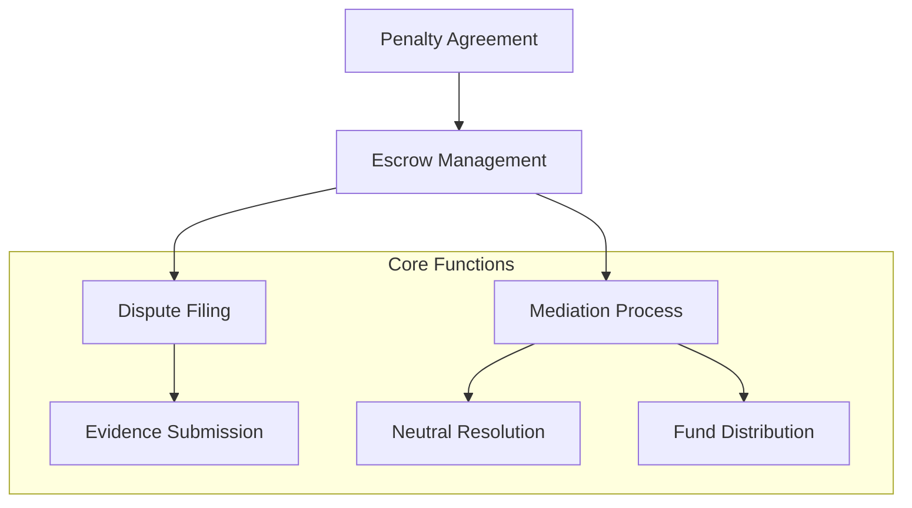

# P2P Penalty Resolution System

A decentralized, blockchain-powered platform for fair and transparent penalty and dispute management built on the Stacks blockchain.

## Overview

P2P Penalty eliminates traditional intermediary barriers by providing a secure, trustless mechanism for handling penalties, compensation, and dispute resolution. The platform enables:

- Parties to create binding penalty agreements
- Secure escrow of penalty funds
- Transparent dispute resolution process
- Neutral mediation for complex scenarios
- Flexible resolution mechanisms

## Architecture



The system consists of several key components:
1. Penalty Agreement Creation
2. Escrow and Fund Management
3. Dispute Resolution
4. Mediated Settlement

## Contract Documentation

### Penalty Agreements
- Managed through `penalty-agreements` data map
- Tracks agreement details, status, and parties involved
- Functions include:
  - `create-penalty-agreement`
  - `accept-penalty`
  - `file-dispute`

### Dispute Management
- Tracked in `penalty-disputes` data map
- Supports neutral mediation and resolution
- Key functions:
  - `resolve-dispute`
  - `add-mediator`
  - `remove-mediator`

## Getting Started

### Prerequisites
- Clarinet CLI
- Stacks wallet
- STX tokens for transactions

### Installation
1. Clone the repository
2. Install dependencies with Clarinet
3. Deploy contracts to your chosen network

### Basic Usage

1. **Create Penalty Agreement**
```clarity
(contract-call? 
  .p2p-penalty-contract 
  create-penalty-agreement 
  'ST1EXAMPLE123 ;; Respondent address
  u5000000 ;; Penalty amount in µSTX
  "Project delivery delay" ;; Reason
)
```

2. **Accept Penalty**
```clarity
(contract-call? 
  .p2p-penalty-contract 
  accept-penalty 
  u1 ;; penalty-id
)
```

3. **File Dispute**
```clarity
(contract-call? 
  .p2p-penalty-contract 
  file-dispute 
  u1 ;; penalty-id
  "Disagreement on terms" ;; Reason
  "Supporting documentation" ;; Evidence
)
```

## Function Reference

### Public Functions

#### Penalty Management
- `create-penalty-agreement`: Initiate new penalty
- `accept-penalty`: Acknowledge and resolve penalty
- `file-dispute`: Open dispute for mediation

#### Dispute Resolution
- `resolve-dispute`: Mediate and distribute funds
- `add-mediator`: Register neutral mediator
- `remove-mediator`: Deregister mediator

### Read-Only Functions
- `get-penalty-details`: Retrieve penalty information
- `get-dispute-details`: Retrieve dispute status

## Development

### Testing
Run tests using Clarinet:
```bash
clarinet test
```

### Local Development
1. Start Clarinet console:
```bash
clarinet console
```
2. Deploy contracts
3. Interact using contract calls

## Security Considerations

### Limitations
- Requires STX for transactions
- Relies on neutral mediators
- Escrow funds locked during agreement period

### Best Practices
- Clearly define penalty terms
- Provide comprehensive evidence
- Choose experienced mediators
- Understand resolution mechanisms
- Keep communication transparent

### Platform Fees
- Platform charges 2.5% mediation fee
- Fees adjustable by contract owner
- Maximum fee capped at 10%